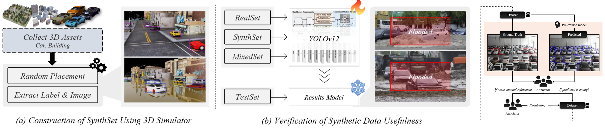
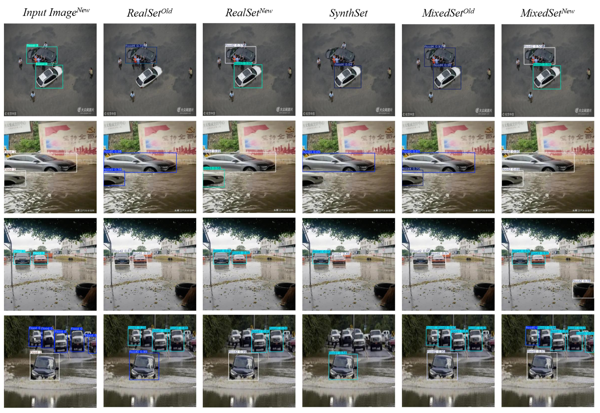

# UrbanFloodSynth
Urban Flood SynthSet Dataset

## Highlights

  
  

- Urban flooding poses increasing risks due to climate change, requiring accurate and scalable detection methods.

- We propose a 3D simulation-based synthetic dataset generation pipeline to overcome real-world data limitations.

- Combined with HITL-refined real data, our method improves flood detection model performance and generalization.

- The approach supports disaster response, smart city monitoring, and is extendable to other environmental scenarios.

## Environments

- python  version : 3.11.4
- pytorch version :  2.0.1
- GPU : A4500*8EA

## Datasets

- ...

## Citations
```java
@article{
   will be announced ...
}
```

## Reference

- https://github.com/cleanlab/cleanlab
- https://github.com/sunsmarterjie/yolov12 ( we used YOLOv12X )
- https://github.com/rigvedrs/YOLO-V11-CAM