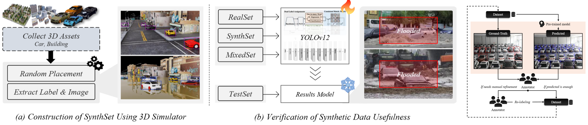
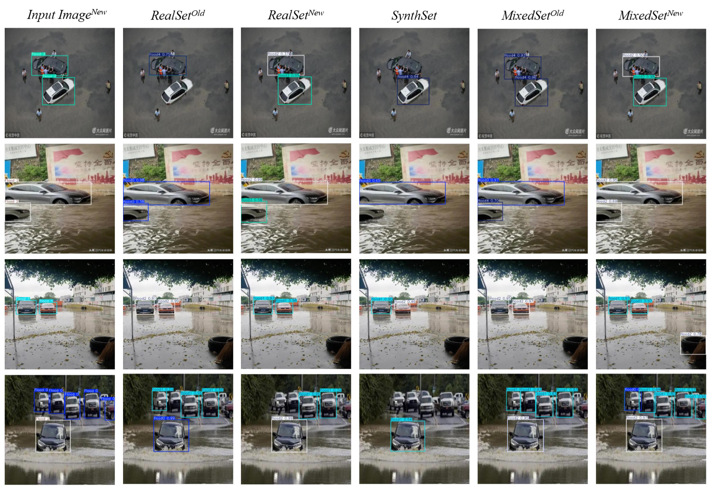
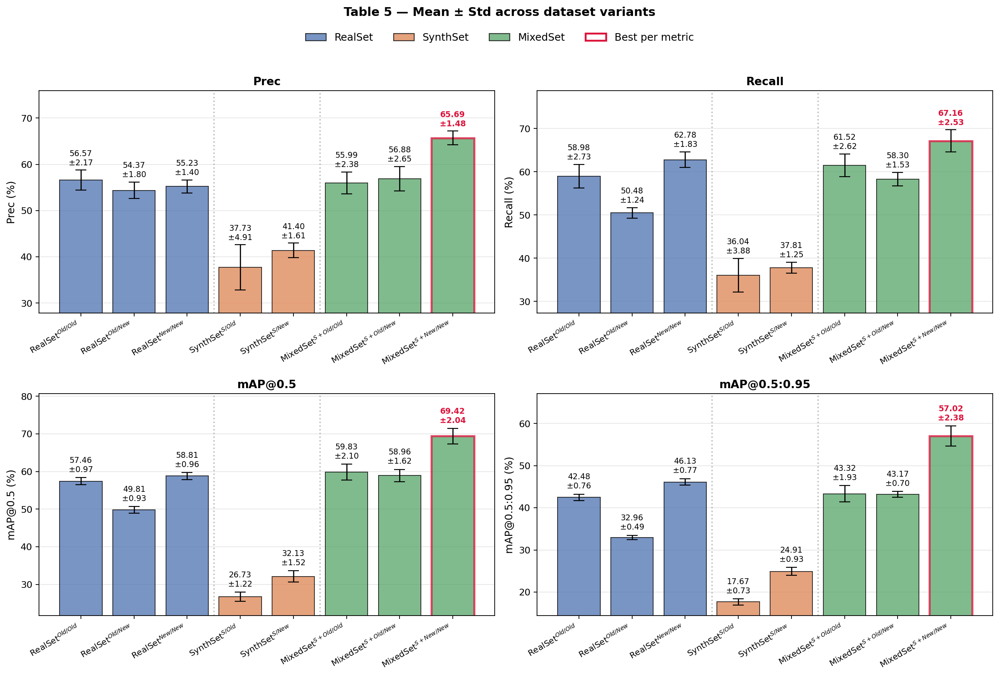

# UrbanFloodSynth

SynthFlood-Car: Synthetic and Refined Dataset for Vehicle Flood-Level Detection

## Highlights

  
  
  
  

- Urban flooding poses increasing risks due to climate change, requiring accurate and scalable detection methods.

- We propose a 3D simulation-based synthetic dataset generation pipeline to overcome real-world data limitations.

- Combined with HITL-refined real data, our method improves flood detection model performance and generalization.

- The approach supports disaster response, smart city monitoring, and is extendable to other environmental scenarios.

## Environments

- python  version : 3.11.5
- pytorch version : 2.10.0+cu128
- GPU : A100*4EA

## Datasets

- https://www.kaggle.com/datasets/yonghoonjung/urban-flood-synthset-with-real (old-version)
- https://doi.org/10.5281/zenodo.20323778 (new-version)

## Citations
```java
@article{
   will be announced ...
}
```

## Reference

- https://github.com/cleanlab/cleanlab
- https://github.com/sunsmarterjie/yolov12 ( we used YOLOv12X )
- https://github.com/rigvedrs/YOLO-V11-CAM